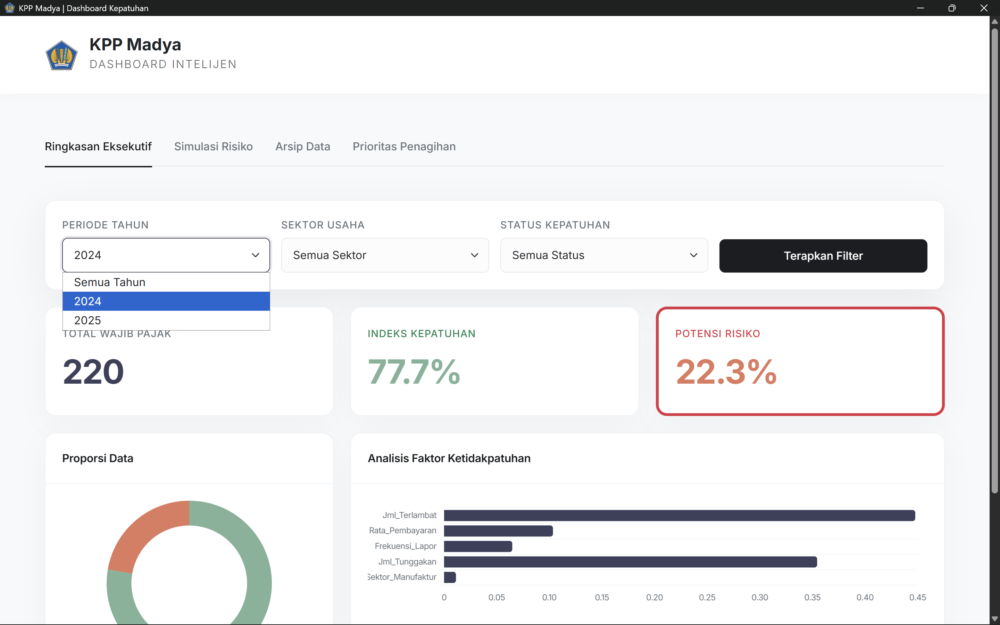

# Machine Learning Taxpayer Compliance Prediction System

## Overview
This project focuses on developing a machine learning–based system to analyze and predict taxpayer compliance patterns using historical data. The goal of this project is to transform raw administrative data into meaningful insights that can assist monitoring and decision-making processes.

By applying data preprocessing, machine learning modeling, and analytical visualization, the system identifies behavioral indicators related to taxpayer compliance and generates predictive insights.

This project was developed as part of an internship project and demonstrates the practical application of machine learning in a real-world administrative and analytical environment.

---

## Key Features
- Data preprocessing and structured dataset preparation
- Machine learning model development for compliance prediction
- Analytical evaluation of prediction results
- Visualization of insights through an analytical dashboard
- Identification of behavioral patterns within taxpayer data

---

## Technologies Used
- Python
- SQL
- Pandas
- Scikit-learn
- Matplotlib / Seaborn
- Jupyter Notebook

---

## Workflow

1. Data collection and preparation
2. Data cleaning and preprocessing
3. Feature selection and pattern identification
4. Machine learning model training
5. Model evaluation and analysis
6. Visualization of prediction insights

---

## How to Run
Download this main file, locate the "dist" folder, go to the "Dashboard_WP" folder, and then open the application titled "Dashboard_WP" to open it

---

## Project Visualization

---

## Results
The system successfully demonstrates how machine learning techniques can be used to analyze compliance-related patterns within structured datasets. The analytical results provide insights that may support monitoring processes and strategic evaluation.

---

## Future Improvements
- Improve model accuracy with additional features
- Develop an interactive dashboard interface
- Deploy the prediction model as a web-based API
- Expand dataset size for deeper analysis

---

## Author
Hans Alexander  
Informatics Engineering Student
